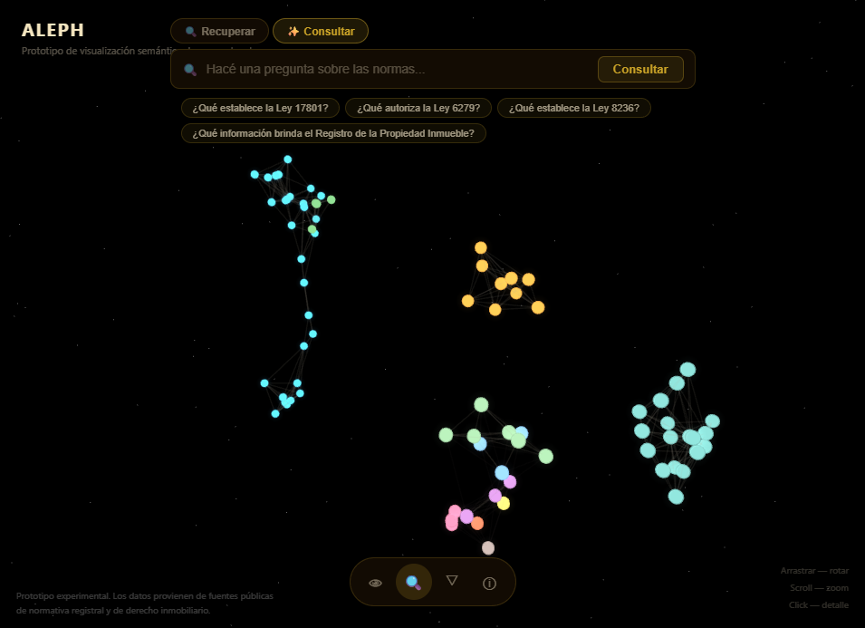
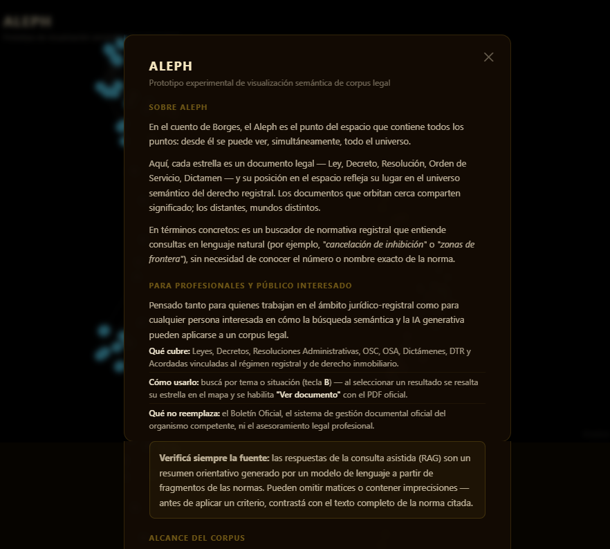

# ALEPH — Buscador semántico y RAG sobre un corpus legal

Prototipo de buscador semántico + RAG (retrieval-augmented generation) sobre un corpus de
normativa registral, inspirado en el proyecto [GINA](https://boa.com.ar). Combina un pipeline
propio de scraping y embeddings, búsqueda vectorial en Postgres/pgvector, generación asistida
por IA con citas a la fuente, y una visualización 3D interactiva del corpus completo.



## Demo en vivo

**[aleph-rag-legal.onrender.com](https://aleph-rag-legal.onrender.com)**

Corre en el free tier de Render — si nadie lo usó en los últimos ~15 minutos, el servidor se
"duerme" y el primer pedido puede tardar cerca de 50 segundos en responder mientras arranca de
nuevo. Tené paciencia, vale la pena verlo andando.

## Por qué ALEPH

> "Vi el Aleph, desde todos los puntos, vi en el Aleph la tierra, y en la tierra
> otra vez el Aleph y en el Aleph la tierra..." — Borges describe un punto que
> contiene, sin superponerse, todos los puntos del universo.

Este proyecto busca una versión chica de esa idea: cada norma del corpus es
una estrella, y su posición en el espacio (reducida con UMAP desde su
embedding) refleja su lugar en el universo semántico del corpus. Las que
orbitan cerca comparten significado; las distantes, mundos distintos. No es
casual el nombre — es, en miniatura, ese punto desde el que se puede ver
todo a la vez.



## Componentes clave

| Herramienta | Rol en el proyecto |
|---|---|
| **EasyOCR** | OCR de respaldo para PDFs sin texto digital (escaneados) — sin esto, esas normas quedarían directamente fuera del corpus. |
| **OpenAI** | Genera los embeddings de nivel-documento (`02_embeddings.py`) que alimentan la recuperación semántica simple (`/api/buscar`, tabla `normas_drp`). |
| **UMAP** | Reduce los embeddings de cientos de dimensiones a solo 3, preservando qué tan parecidas son las normas entre sí — arma las coordenadas de cada estrella en la galaxia. |
| **Supabase** | Postgres gestionado + extensión pgvector: guarda los embeddings y resuelve la búsqueda por similitud coseno vía funciones RPC, sin necesitar un motor de vectores aparte. |
| **Ollama** *(backend `local`)* | Corre `nomic-embed-text` y `llama3.2:3b` en la propia máquina — gratis y sin límite, requiere GPU/CPU propia. |
| **Nomic** *(backend `cloud`)* | Reemplaza a Ollama para el embedding de la consulta — misma familia de modelo, hosteada, así los vectores siguen siendo compatibles con los ya cargados en Supabase sin re-embeber el corpus. |
| **Groq** *(backend `cloud`)* | Reemplaza a Ollama para la generación — modelos Llama sobre hardware propio (LPU), mucho más rápido que CPU local. |

## Qué hace

- **Recuperación semántica** (`/api/buscar`): encuentra normas por significado, no por
  coincidencia de palabras — funciona aunque la consulta no comparta ni una palabra literal
  con el texto de la norma.
- **Consulta asistida (RAG)** (`/api/consultar`): recupera los fragmentos más relevantes y
  redacta una respuesta citando la norma de origen, en vez de solo devolver una lista de
  resultados.
- **Galaxia 3D** (`galaxia.html`): cada norma es una estrella; su posición en el espacio
  (reducido con UMAP desde el embedding original) refleja qué tan parecida es en contenido a
  las demás. Documentos que orbitan cerca comparten significado.
- **Dos backends de IA intercambiables**, vía una sola variable de entorno:
  - `local` (default): Ollama corriendo en la propia máquina — gratis, sin límite de uso,
    requiere GPU/CPU propia.
  - `cloud`: Groq (generación) + Nomic (embeddings), ambos con free tier — pensado para
    desplegar en un hosting sin GPU (Render, etc.) sin tener que re-generar el corpus, porque
    Nomic sirve el mismo modelo de embeddings que corre localmente con Ollama.

## Arquitectura

```
scraping → texto completo (OCR si hace falta) → embeddings → Postgres/pgvector (Supabase)
                                                                      │
                                                    Flask (server.py) │ /api/buscar
                                                                      │ /api/consultar (RAG)
                                                                      │
                                                     galaxia.html (Three.js) ← UMAP 3D
```

**Stack**: Python (scraping, pipeline), Flask, Supabase/pgvector, Ollama (`nomic-embed-text`,
`llama3.2:3b`) o Groq/Nomic en la nube, UMAP, Three.js/WebGL.

## Pipeline de datos (`scripts/`)

| Script | Qué hace |
|---|---|
| `01_scraper.py` | Descarga los PDFs de la fuente configurada, clasifica tipo/número/año y arma `data/normas_raw.csv`. |
| `01b_ocr_easyocr.py` | OCR de respaldo (EasyOCR) para PDFs escaneados sin texto digital. |
| `02_embeddings.py` | Genera embeddings de nivel-documento (OpenAI) → `data/normas_vectors.json`. |
| `03_cargar_supabase.py` | Sube esos vectores a Supabase (tabla `normas_drp`, pgvector). |
| `04_buscar.py` | Buscador de prueba por consola, online (Supabase) u offline (JSON local). |
| `05_ocr_textos.py` | Extrae el texto completo de cada PDF → `data/textos_completos/*.txt`. |
| `05_galaxia.py` | Reduce los embeddings a 3D con UMAP → `data/galaxia.json`, para la visualización. |
| `06_chunks_subir.py` | Chunkea el texto completo, embeddings locales con Ollama, sube a `norma_chunks` (usado por el RAG). |
| `07_fix_duplicados.py` / `08_ocr_pendientes.py` | Utilidades de mantenimiento del corpus. |
| `poc_groq_nomic.py` | Valida el backend `cloud`: compara el embedding de Nomic contra el local y prueba una consulta RAG completa con Groq. |

> El corpus scrapeado (`data/`, `pdfs/`) no está incluido en este repo — se regenera corriendo
> el pipeline contra la fuente que configures en `01_scraper.py`. El corpus de referencia usado
> para este prototipo tiene ~77 documentos.

## Cómo correrlo

```bash
python -m venv .venv
.venv\Scripts\activate      # Windows; en Linux/Mac: source .venv/bin/activate
pip install -r requirements.txt              # lo único que necesita server.py

cp .env.example .env         # completar SUPABASE_URL / SUPABASE_KEY / DB_PASSWORD
```

Para correr el pipeline de datos (`scripts/01` a `08`, scraping/OCR/embeddings) hace falta además:
```bash
pip install -r requirements-pipeline.txt
```

**Backend local (Ollama)**:
```bash
ollama pull nomic-embed-text
ollama pull llama3.2:3b
python server.py
```

**Backend cloud (sin GPU)** — completar `GROQ_API_KEY` y `NOMIC_API_KEY` en `.env`:
```bash
BACKEND=cloud python server.py
```

Abrir `http://localhost:5001`.

## Desplegar en Render

El repo incluye un `render.yaml` (Blueprint) listo para un Web Service con el backend `cloud`
(Groq + Nomic) — no hace falta GPU ni Ollama.

1. En Render: **New > Blueprint**, conectar este repo de GitHub.
2. Completar a mano, en el dashboard, las variables marcadas como secretas en `render.yaml`:
   `SUPABASE_URL`, `SUPABASE_KEY`, `GROQ_API_KEY`, `NOMIC_API_KEY`.
3. Cada push a `main` re-despliega automáticamente.

> Free tier: el servicio se duerme tras ~15 min sin uso, con un arranque en frío de unos 50s en
> el siguiente pedido.

## Diferencias con GINA

| Aspecto | GINA | ALEPH |
|---|---|---|
| Corpus | 400.000 normas nacionales | ~77 normas (prototipo) |
| Fuente | datos.gob.ar (CSV único) | scraping propio de un portal provincial |
| Infraestructura | BigQuery + GCS | Supabase (gratuito) |
| Generación | — (solo recuperación) | RAG con citas a la fuente |
| Visualización 3D | Sí (UMAP + Three.js) | Sí (UMAP + Three.js) |

## Estado y aviso

Prototipo experimental, 2026. Pensado como pieza de portfolio para explorar búsqueda semántica,
RAG y visualización de embeddings sobre un corpus legal chico — no es un producto en producción
ni una herramienta oficial de ningún organismo.

Los datos provienen de fuentes públicas de normativa registral y de derecho inmobiliario. Las
respuestas generadas por el modelo de IA (RAG) son un resumen orientativo a partir de fragmentos
de las normas — pueden omitir matices o contener imprecisiones, y no reemplazan la lectura del
texto completo de la norma citada ni el asesoramiento legal profesional.
